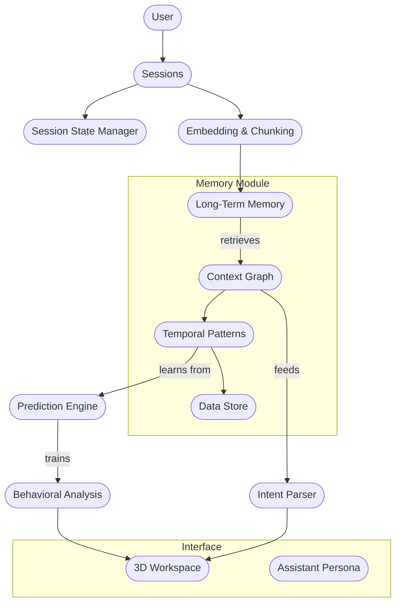

# ARCHITECTURE.md

## Mnemosyne Architecture Preview  
*Conceptual Overview — Full Implementation in Development*

> ⚠️ Mnemosyne is currently in private development. This document shares the high-level architecture and design intent of the memory system enabling consciousness partnership interfaces. Specific implementation details and code will be released following demonstration.

---

## 🧠 Overview

Mnemosyne is a real-time, learnable memory system designed to enable:
- Persistent context awareness
- Fast adaptation to user behavior
- Episodic recall across interactions
- Predictive preparation of relevant information

Unlike static RAG-based systems or fixed embeddings, Mnemosyne uses a **gradient-updated neural memory** that evolves in-session.

---

## 🧱 Key Architectural Principles

### 1. **Memory-First Design**
All interface decisions prioritize memory continuity and adaptive context retention.

### 2. **Surprise-Driven Learning**
The system updates itself in real time when new information diverges from expectations. This keeps memory relevant and compact.

### 3. **Inference-Time Updating**
No need for retraining. All learning happens through interaction, at the moment of engagement.

### 4. **Multi-Modal Support**
The memory is designed to work with language, vector embeddings, metadata, and user context traces.

### 5. **Persistent Persona Layer**
Memory is contextualized per user, project, or agent persona, allowing switching and long-range continuity.

---

## 🔧 Component Overview

| Component | Purpose |
|----------|---------|
| Memory Core | Fast-weight gradient-update module for real-time learning |
| Readout Engine | Surface relevant memory given a query or context frame |
| Update Path | Computes delta between expected and actual embeddings, updates accordingly |
| Context Manager | Maintains long-term threads, sessions, and task anchors |
| Monitoring Layer | Tracks surprise history, capacity usage, and memory activation traces |

---

## 🎯 Target Capabilities (In Progress)
- Ingest structured or unstructured data and build contextual memory
- Recall relevant threads or facts based on ambient user activity
- Provide time-anchored recall and forward-predicted support
- Maintain collaborative memory across user sessions
- Visualize attention and memory trace over time

---

## 🧩 Mnemosyne System Diagram (Mermaid.js)

---

## 🔒 Implementation Status

Mnemosyne is currently under development in a private, modular codebase. The team is focused on delivering a functional prototype that:
- Demonstrates working memory across interactions
- Surfaces context before it's requested
- Adapts to a user's evolving workflow and goals

Public release will follow successful demonstration and user validation.

**Contact**: [awiley@outlook.com]

---

*Mnemosyne is not just memory. It’s the cognitive core for the next generation of AI interfaces.*
